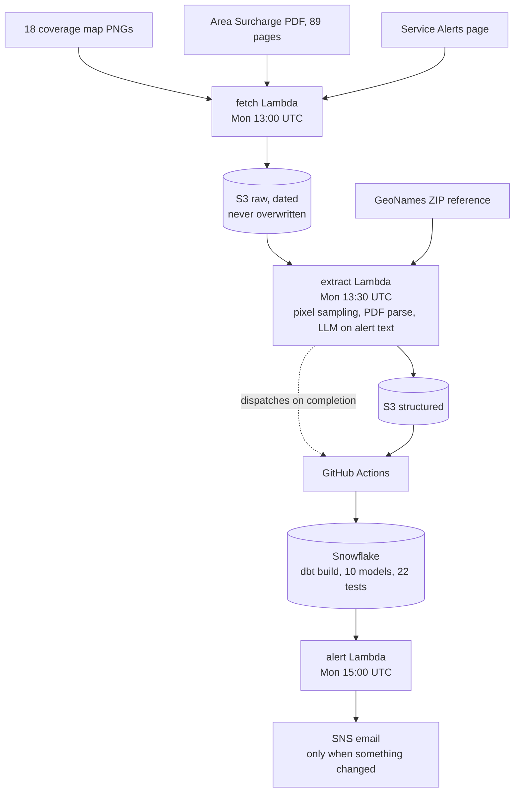
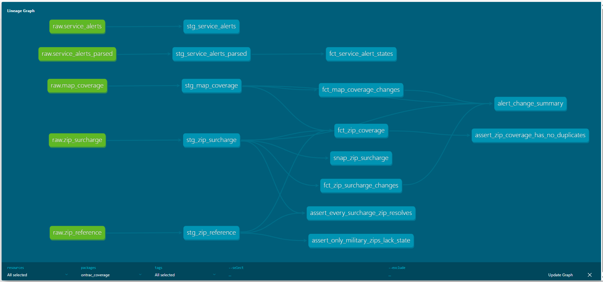
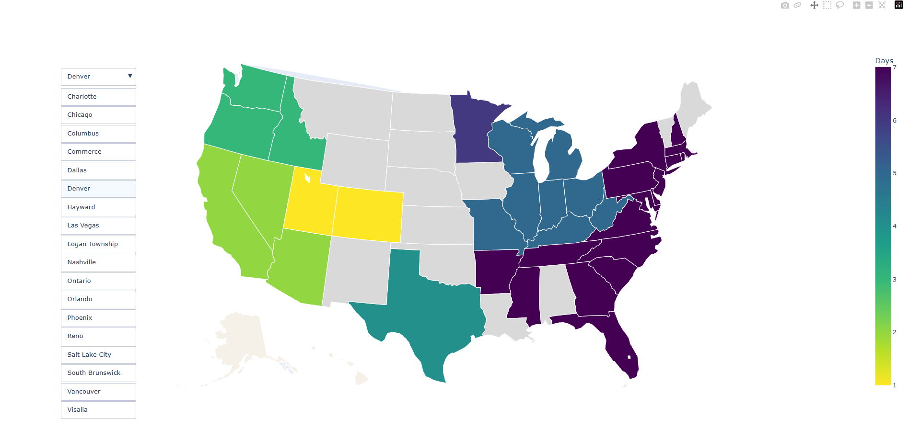
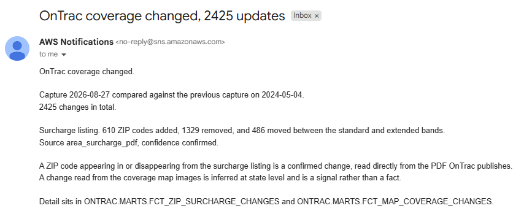

# OnTrac Coverage Watch

A weekly pipeline that records everything OnTrac publishes about where it delivers, keeps a history nobody else keeps, and reports exactly what changed.

Built August 2026 by Philip Vu.

---

## The finding that shapes this project

**ZIP pair delivery eligibility is behind a credential wall on every public path.**

- The coverage map is a set of pre rendered PNG images. Transit days and unserved states are pixels, not data. No JSON, no GeoJSON, no state list anywhere in the markup.
- The legacy tools that once held it, ZIPTools and Rate Zones and Maps, are retired and redirect to marketing pages.
- OnTrac's API requires an active shipper account, and its public API page is a terms of use document rather than technical docs.
- Every aggregator, EasyPost, Shippo, ShipEngine and Pitney Bowes, requires you to bring your own OnTrac credentials. None resell OnTrac on their own account.
- Even with credentials, enumerating every pair across roughly 41,000 US ZIP codes means millions of calls against terms that ask for reasonable use.

Three hours of checking before a line of code was written. **The source is the hard problem here. The pipeline is the easy part.**

**There is also no public zone chart.** OnTrac's 2026 rate card prices Zones 2 through 8 across three pages and never states how an origin and destination pair maps to a zone. That is recorded here as a finding, not as future work.

---

## A second finding, which fell out of building it

**Two documents OnTrac publishes disagree with each other about 6192 ZIP codes.**

The Area Surcharge listing names ZIPs in all 50 states plus DC, and states on every page that the surcharge applies to ZIPs *within the OnTrac service area*.

The coverage map, extracted across all 18 sort centers, shows an identical 35 state footprint from every single origin. Coverage does not vary by origin at all. Only transit speed does.

6192 of the 24,653 surcharged ZIPs sit in 16 jurisdictions the map either draws as unserved or does not draw at all.

| jurisdiction | surcharged ZIPs | on the coverage map |
|---|---|---|
| IA | 888 | not served |
| KS | 599 | not served |
| OK | 596 | not served |
| AL | 545 | not served |
| NE | 523 | not served |
| AK | 211 | **not drawn at all** |
| HI | 67 | **not drawn at all** |

Neither source can be verified without shipper credentials. That is why **every row in the output carries where it came from and how much to trust it**.

---

## What changed, measured

The Area Surcharge listing effective May 4 2024 against the one effective June 16 2026.

| change | ZIP codes |
|---|---|
| removed from the listing | 1329 |
| added | 610 |
| moved between surcharge bands | 486 |
| unchanged | 23557 |

**2425 ZIP codes moved. A row count comparison reports 719,** because 610 additions cancel against 1329 removals.

Of the 486 that changed band, 311 moved into the more expensive Extended tier and 175 moved out.

Counting tells you the list got shorter. Only diffing tells you what happened.

---

## Architecture





**A note on Lambda rather than containers.** Plenty of teams would run this on ECS. There is no long running work here, so containers would be setup cost without payoff at this scale. Stated rather than hidden, because being able to explain a tradeoff beats picking whatever looked most impressive.

**The dbt step is event driven, not scheduled.** It was on a cron until the first unattended Monday, when GitHub's scheduler silently skipped it. The extract Lambda now dispatches the workflow on completion, so transformation runs because the data is ready rather than because a clock guessed how long extraction takes. The cron remains as a backstop.

---

## What it produces

**One coverage table, keyed at ZIP, with provenance on every row.** Not two tables.

| source | grain | confidence |
|---|---|---|
| Area Surcharge PDF | ZIP5, exact | `confirmed` |
| Coverage map PNGs | state expanded to its ZIPs, per origin | `inferred` |
| Split states and DC | same, but the reading is ambiguous | `inferred_ambiguous` |

754,859 rows. Roughly 40,000 destination ZIPs described from all 18 origins, plus 24,653 confirmed surcharge rows.

The question was posed at ZIP level, so the schema is ZIP shaped everywhere and a state derived row is an honest low confidence entry rather than a different answer to a different question. When credentialed data appears it populates the same table at `confirmed` and nothing downstream changes.

---

## Questions it answers

**Can OnTrac reach this ZIP, and how fast from each facility?**

```sql
SELECT origin_sort_center, transit_days, confidence
FROM ontrac.marts.fct_zip_coverage
WHERE zip5 = '89101' AND origin_sort_center IS NOT NULL
ORDER BY transit_days;
```

**Where does geography lie to you?** Every state that is faster from North Carolina than from Texas.

```sql
WITH by_origin AS (
    SELECT sort_center, state, transit_days
    FROM ontrac.staging.stg_map_coverage
    WHERE captured_on = (SELECT MAX(captured_on) FROM ontrac.staging.stg_map_coverage)
      AND transit_days IS NOT NULL
)
SELECT dallas.state, dallas.transit_days AS from_dallas, charlotte.transit_days AS from_charlotte
FROM by_origin dallas
JOIN by_origin charlotte ON charlotte.state = dallas.state
WHERE dallas.sort_center = 'Dallas'
  AND charlotte.sort_center = 'Charlotte'
  AND charlotte.transit_days < dallas.transit_days;
```

Las Vegas is 4 days from Charlotte and 5 from Dallas, despite Dallas being roughly 800 miles closer. OnTrac runs four sort centers in California and the eastern freight flows into that cluster. Distance does not predict transit time. Network shape does.

**Where do OnTrac's own sources disagree?** See `13_example_questions.sql` for this and four more.

---

## Coverage map



Three outcomes, three layers, on purpose.

- **Coloured**, a known transit day from that origin
- **Grey**, OnTrac drew the state and does not serve it
- **Cream**, OnTrac never drew the state at all

`no_data` is never collapsed into `unserved`. Rhode Island is transparent on the Charlotte map rather than grey, and a pipeline that treated those the same would be turning an artwork gap into a coverage claim.

---

## The alert



Every word in that email comes out of SQL. The Lambda reads a row and puts it in an envelope. It writes no prose, so changing how a change is described is a one file edit.

It sends nothing when nothing changed, which is most weeks.

---

## Stated limits

**The surcharge listing is a price schedule, not a coverage document.** An earlier version of this README called it a lower bound on coverage. That was wrong, and it was corrected once the numbers existed. A quarter of it falls outside the footprint its own publisher draws, so it is neither a floor nor a ceiling.

**Map derived rows are state level.** A ZIP inherits its state's reading. Seven states are visibly not uniform, so those rows carry `inferred_ambiguous`.

**DC is smaller than the sample box.** Its reading necessarily includes Maryland pixels and is marked ambiguous for that reason.

**The LLM step does not run on Cortex.** Snowflake Cortex was the intended tool, since the parsing already sits inside the warehouse, but AI functions are blocked on trial accounts. The Cortex implementation is committed as `fct_service_alerts_cortex.sql.disabled` with the exact error and the date verified. The working version runs the same prompt against the Anthropic API. Swapping back on a paid account is one function call.

**Out of scope.** Zone derivation, any carrier other than OnTrac, rate calculation, and brute force enumeration of ZIP pairs.

---

## What broke, and what it taught

Kept because a project with no recorded failures reads as one nobody ran.

| what broke | what it taught |
|---|---|
| A hardcoded PDF URL fed a two year old document for days, passing every validation | Validation answers whether a file is a plausible PDF, not whether it is the right one. The URL is now read off the page every run |
| `403` instead of `404` on the first deployed Lambda | Least privilege bugs only appear in the least privileged place. Local runs under an admin identity prove nothing |
| A reused execution role could not write its own logs | Console created Lambda roles pin log permissions to one function. Identical permissions was an assumption, not an observation |
| `fct_zip_coverage` silently doubled the day a second capture existed, and all 21 tests passed | A test suite written against today's data locks in today's assumptions |
| The first unattended run emailed a stale comparison | Deriving latest from a table that only holds exceptions gives you the latest exception. An alert that repeats stale data is worse than one that never fires |
| GitHub's scheduled workflow silently did not fire | A schedule you cannot test is a schedule you cannot trust |

Three of those were found by reading output, not by a test failing.

---

## Running it

```bash
python -m venv .venv
.venv\Scripts\activate
pip install -r requirements.txt
```

**Local extraction**, reads from S3 and writes CSVs into `out/`.

```bash
python extract_maps.py
python parse_pdf.py
python test_maps.py
```

**The warehouse**, requires `~/.dbt/profiles.yml` pointing at Snowflake with key pair auth.

```bash
cd dbt
dbt build
```

`dbt build` runs the `COPY INTO` hooks, all 10 models, the snapshot and all 22 tests in one command.

**The map.**

```bash
python make_map.py
```

**Lambda packaging.** Deployment packages are not built from `requirements.txt`. They are built with platform flags, because `pip install` on Windows pulls binaries that cannot load on Amazon Linux.

```bash
pip install --target build --platform manylinux2014_x86_64 --implementation cp --python-version 3.12 --only-binary=:all: requests beautifulsoup4
```

`boto3` is deliberately excluded because the Lambda runtime ships it. Packages over roughly 10 MB deploy through S3 rather than the Lambda API, which fails partway through large uploads.

---

## Layout

```
fetch.py               ingest Lambda, four sources, retry and validation
extract_maps.py        pixel sampling across 18 map PNGs
parse_pdf.py           89 page surcharge PDF into ZIP5 rows
extract_handler.py     extract Lambda, also runs the LLM step and dispatches dbt
alert_handler.py       reads Snowflake, publishes to SNS
make_map.py            interactive coverage map
build_zip_ref.py       GeoNames into a pinned ZIP to state reference
dbt/                   10 models, 1 snapshot, 22 tests
iam/                   every policy, committed and readable
spikes/                throwaway exploration, kept as history
docs/                  the three images above
```

No secrets are in this repository. The Snowflake key, the Anthropic key and the GitHub token all live in AWS Secrets Manager, and the trust policy carrying the Snowflake external ID is gitignored.